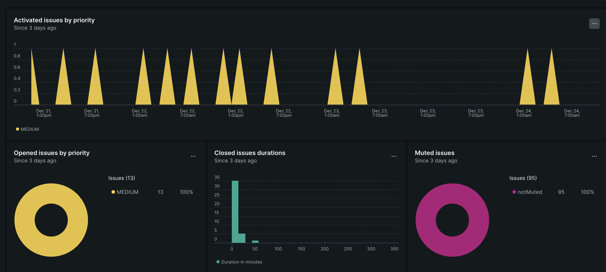

# Getting started with alerts

Setting up alerts to notify you of issues with your dApp is one of the most important things you can do to monitor your data. However, creating and managing alerts often feels overwhelming. In the following tutorials, we'll walk you through the three main ways to create alerts with Encinitas. We'll also show you how to use those alerts to gather information and use that data to improve your stack. We have some basic alerting concepts and terminology to learn before jumping in if you're entirely new to alerts.

## What are alerts?

Alerts are conditions that, when met, send you notifications about the triggering event. You can have notifications sent to any number of people across any number of teams. When properly configured, alerts enable you to solve an issue more efficiently by sending direct messages to the groups that can fix a problem. There are five main parts to alerts:

- Incidents are events where a condition threshold is breached. Common examples of incidents are when latency goes over a specific limit, a page fails to load, or Solana transaction errors occur.
- Issues are a collection of one or more incidents that cause a notification to be sent.
- Conditions are configuration objects that you set up to open an incident.
- Policies are groupings of conditions where you define how you get notified when an incident occurs.
- Notifications are the messages that you receive when an issue is opened, acknowledged, or closed.

## Where are alerts in Encinitas?

In Encinitas, you often manage your alerts from one.encinitas.xyz > Alerts. This section of the platform has an Overview page that gives you visual breakdowns of all your alerts and an Alert conditions (policies) page, which provides you with a list of all your alerting policies and a place to create new ones.
