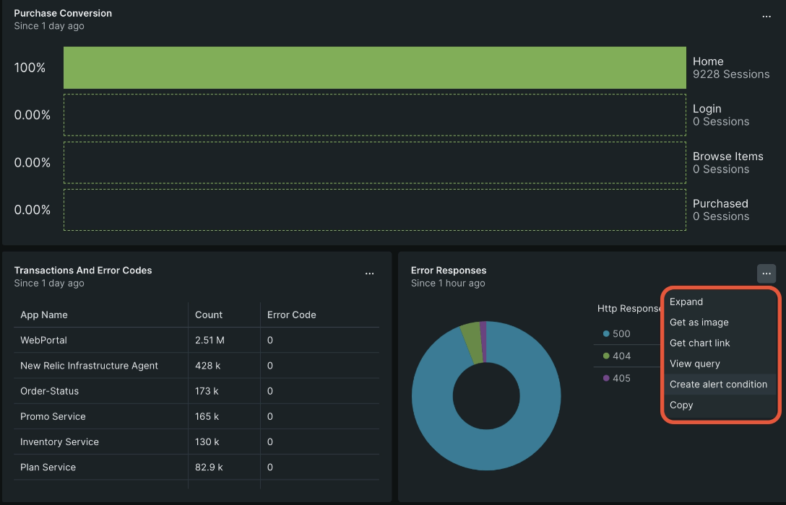
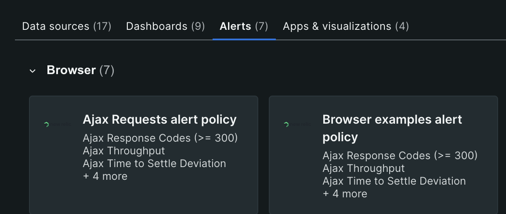
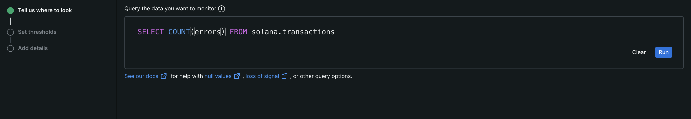

# Create your alerts

There are three ways to create an alert condition in Encinitas: With a chart, an SQL query, or key metrics. While the beginning of the creation process is different depending on which option you choose, all the subsequent steps are the same. This means that once you've created a condition one way, the experience you gain from doing so will transfer to others you create using either of the other options.

For this tutorial, we've included steps for all three options mentioned above so you can get started with your first condition any way you want. Select the path you want to follow in the first step, and by the end of the procedure, you'll have successfully made your first alert condition using Encinitas!

## Create using chart

Starting from a chart is one of the easiest ways to set up an Encinitas alert condition. Instead of creating the alert from scratch, charts let you use pre-existing metrics to begin the process.

We'll set up an alert condition using an error response chart in this example. Follow the steps below with any chart you like to begin.



1. Go to any dashboard. Then, find a chart you want to use, click the "..." menu, and select Create alert condition.

2. Select the signal or stream of data you want to use to create the alert condition. To simplify things, Build a query is the default option for conditions created this way.

3. Modify the query to match what you want to monitor, if necessary. For now, we recommend leaving the query as is, but once you have a better handle on alerts and queries, you can change the query to monitor nearly any signal.

4. Select Next once you've finished to save your progress and move on to the next step.

## Create using key metrics

One of the easiest ways to get started is to use our key metric option. This capability gives you a guided creation path for making a condition when selected. All you have to do is choose your options, and let us do the rest!

The following example will use specific options, but you can change whatever you need to create the exact alert condition that fits your needs.



1. From one.encinitas.xyz, select Alerts, then Alert conditions.

2. Choose any of the listed categories to determine what the alert condition will monitor. 

3. Select the dApp you want to monitor. If you have many dApps to choose from, you can use the filter field to shorten the list and find what you need.

## Create using a SQL query



While charts are a great way to create alert conditions from premade queries, sometimes you must create them from scratch. Creating a new alert condition from a SQL query is almost the same as creating it from a chart: the critical difference is that you write the SQL query manually instead of using a pre-generated one.

1. From one.encinitas.xyz, select Alerts, then Alert conditions (policies).

2. Select New alert condition.

3. Write the SQL query to create the condition. For example, if you want to monitor slow transactions, you can enter the following:

```sql
SELECT AVG(duration) from transactions
```

4. Select Next once you've finished to save your progress and move on to the next step.
