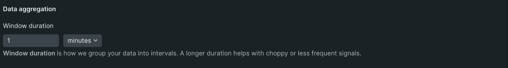

# Adjust the alert behavior

## Set the window duration option

1. Use the Window duration setting to determine how frequently we aggregate your data, such as groupings every 5 minutes or every hour. The setting for this feature depends on what kind of data you're monitoring. If you're unsure what it should be, leave it at the default setting. 
2. Select Next once you've finished to save your progress and move on to the next step.

## Set the static thresholds

1. Start by selecting whether the threshold will have a status of Critical or Warning in the Security level section.

2. Set the limit that, when met, will open an incident. These values will change depending on what you want the condition to do. For example, if you wanted to create a condition for an error message, you might set the threshold to equal to 1 at least once in 5 minutes. Still, if you wanted to create a condition for more extended latency periods, you might set the threshold to above or equal to 50 for at least 15 minutes.

3. If you want to add another threshold, select either Add threshold or Add lost signal threshold, depending on your needs. Lost signal thresholds are essential for monitoring entities that may stop reporting or queries that may return null values.

4. Select Next once you've finished to save your progress and move on to the next step.
