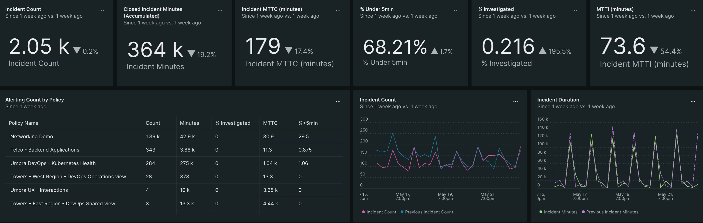

# Optimize your alerts

As time goes on, your number of alerts will grow. This can lead to problems for your organization if they're not managed correctly. Additionally, your alerts will give you crucial information you can use to improve your system. You need to take advantage of that information to use your alerts to their fullest potential.

You can learn how to manage the quality of your alerts to prevent things like alert fatigue and how to use alerts to gather data and positively impact your organization by using the alerts & incidents dashboard.

## Manage your alert quality

When teams receive too many alerts or too many false alarms, alert fatigue begins to occur. As either factor increases, fatigue begins to have serious, negative consequences. Overwhelmed incident responders become used to false alerts and prioritize ones that are easier to resolve quickly instead of more severe issues. Worse, they often begin to close unresolved incidents to stay within response time targets. This means accurate alerts become lost in the noise while incident response times and severe outage occurrences increase.

To fix alert fatigue and prevent it from occurring in the future, you must improve the quality of your alerts. This ensures that you and your team focus on the right places at the correct times.

It's a good moment to improve your alert quality if:

- You have too many alerts.
- You have alerts that stay open for long periods.
- You have a lot of alerts that need to be more relevant.
- Your customers discover your issues before your monitoring tools do.
