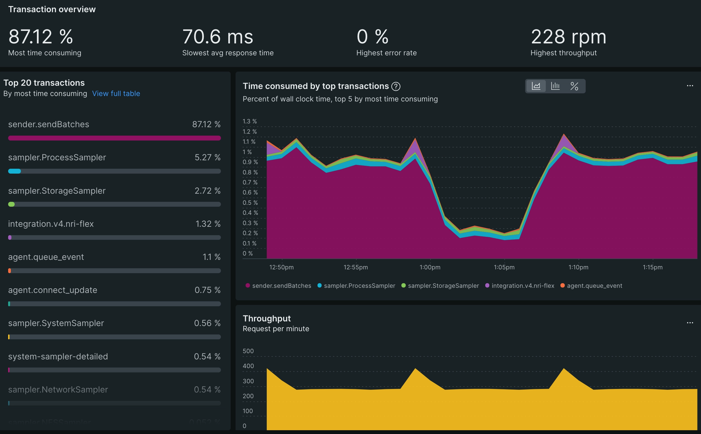

---
sidebar_position: 2
--- 

# Find your slow interactions 

1. Sort your interactions by most time consuming on the top of the page.
2. Take a look at the Top 10 interactions chart. This list represents the best opportunity to reduce load of your application. Shaving time off these frequently called interactions will reduce the footprint of your application as they are high-volume requests. Take note of the top few interactions in this chart.

3. Sort your interactions by slowest average response on the top of the page.
4. Take a look at the Top 10 interactions chart again. This chart now shows the average time per request from the total volume of a particular request. Take note of the top few interactions in this chart.
