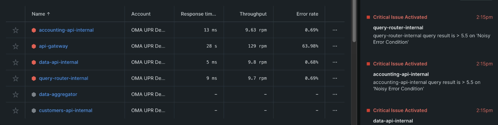

---
sidebar_position: 3
--- 

# Track errors in your interactions

Now that your dApps are instrumented, Encinitas is capturing data about your services. This includes data about error occurrences in the user's interactions.

Imagine you run a DeFi dApp. You've received two alerts for two components, one for unstaking and one for swaping. You're only receiving reports in twitter that the unstaking functionality is failing. You may believe that the unstaking is more important, but it's critical to separate your beliefs from your observability practices.

This practice applies even if the end user hasn't reported anything. When you notice services failing, you can ask yourself these questions:

- Is the end user experiencing a problem?
- How should their experience look?
- What behavior are they currently experiencing?

## Determine what interactions are reporting errors

Let's see how this might look in practice. When you view the All entities page, you notice four services are alerting.

After asking yourself the questions from step one, you know that:

- The end user is struggling with unstaking.
- Your site should only display tokens with liquidity.
- Your site is displaying all tokens, so customers are able to purchase out-of-stock items.
> You've identified that solana-gateway is a critical dependency. This is where you'll begin your error analysis.

Check the segment breakdown chart. This shows where your request spends most of its time. If, on average, a route stalls in one part of your code, then focus on optimizing in that segment.
Check the transaction traces table and gather your slowest traces. While your slowest traces are outliers, they’re good indicators of what methods, databases, or HTTP calls have the biggest impact on your app’s performance.

