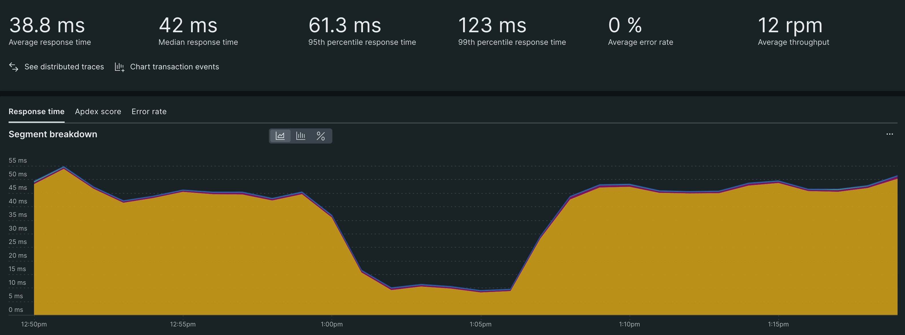

---
sidebar_position: 4
--- 

# Improve your performance

You’ve identified what interactions may cause delays in your code, but knowing about an issue isn’t the same as finding a solution for your customers. With the interactions identified above, you can find a breakdown of where in your code this particular route spends the most time.

For each of your interactions, click on their name in the top 20 chart and do the following:

Check the segment breakdown chart. This shows where your request spends most of its time. If, on average, a route stalls in one part of your code, then focus on optimizing in that segment.
Check the transaction traces table and gather your slowest traces. While your slowest traces are outliers, they’re good indicators of what methods, databases, or HTTP calls have the biggest impact on your app’s performance.
